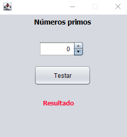

<h1 align="center">
  Números primos
</h1>

 

  

 

## **Sobre o projeto**

#### Identificador de números primos, desenvolvido para aprimorar os conhecimentos em Java Swing.

Quando o campo é preenchido e o botão "Testar" é clicado, o "resultado" é alterado, mostrando se o número digitado é um número primo ou não.

 

## **Tecnologia utilizada**

